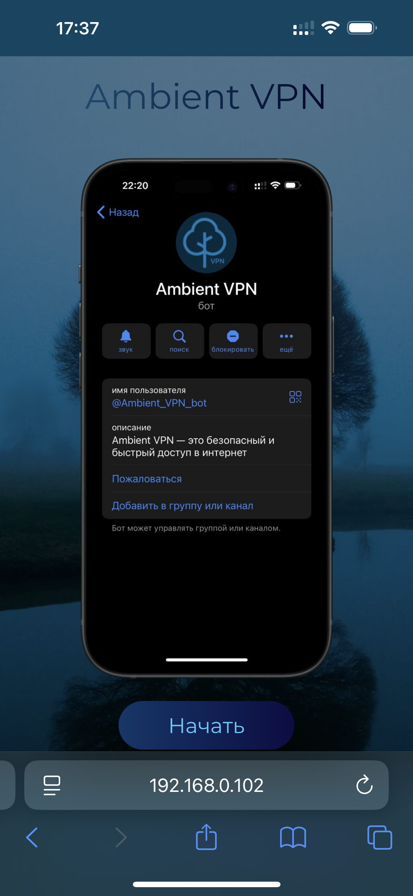
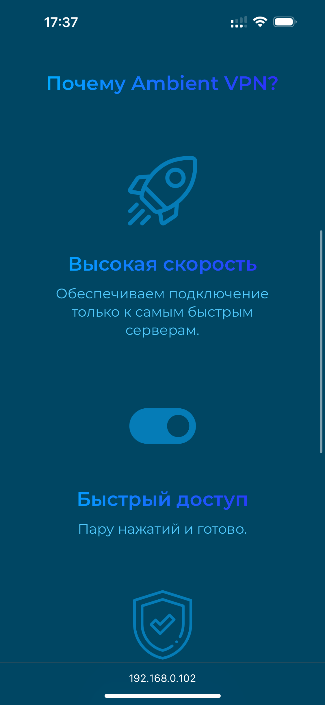
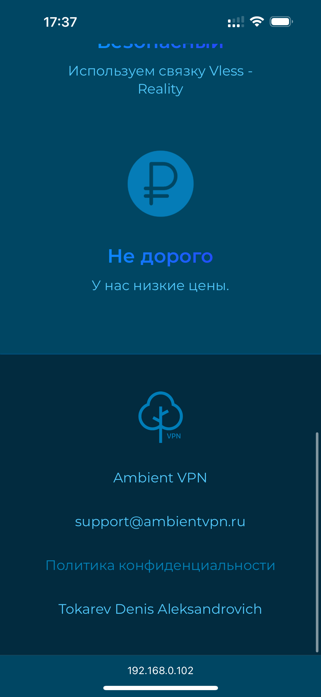

# Ambient VPN Web

**Ambient VPN Web** — это веб-приложение для Ambient VPN





# Содержание
- **[Технологии и инструменты](#технологии-и-инструменты)**
- **[Установка и запуск](#установка-и-запуск)**

## Технологии и инструменты

### Языки программирования и фреймворки

- **Python 3.11**
- **Django 5**

### Инструменты разработки
- **Mypy**
- **Flake8**
- **Black**
- **Isort**
- **Pre-commit**
- **Poetry**
- **Git**
- **GitHub**

### Базы данных
- **PostgreSQL**

### Web технологии
- **HTML**
- **CSS**

### Серверные технологии и безопасность
- **Gunicorn**
- **Nginx**
- **CSP**
- **HTTPS**
- **The nginx version is disabled**

### Контейнеризация

- **Docker**
- **Docker Compose**


## Установка и запуск

### 1. Создайте .env в корне проекта или запустите файл init_env.py:

- **Запустите файл init_env.py:**

```
poetry python init_env.py
```

- **Создайте .env в корневом каталоге проекта:**

```dotenv
# .env

# DJANGO SECRET KEY
SECRET_KEY=...

# DJANGO DEBUG
DEBUG=True

# DATABASE CONNECT SETTINGS
POSTGRES_DB=...
POSTGRES_USER=...
POSTGRES_PASSWORD=...
POSTGRES_HOST=database# docker container name
```

### 2. Соберите docker compose:
```shell
sudo docker compose up --build
```

### 3. Получите сертификат (при первом запуске):
```
sudo docker run -it --rm \
  -v "./nginx/certbot:/var/www/certbot" \
  -v "./etc/letsencrypt:/etc/letsencrypt" \
  certbot/certbot certonly \
  --webroot \
  --webroot-path=/var/www/certbot \
  -d ambientvpn.ru\
  -d www.ambientvpn.ru\
  --email support@ambientvpn.ru \
  --agree-tos \
  --no-eff-email
```

**Примечание:** *Cертификат можно получить только при запущенном сервере.*

### 4. Необходимо раскомментировать части кода в nginx/nginx.conf. Затем пересобрать docker compose:

```shell
sudo docker compose up --build
```

### 5. Проверьте работоспособность веб-приложения:

```shell
curl -o - -I https://ambientvpn.ru
```
